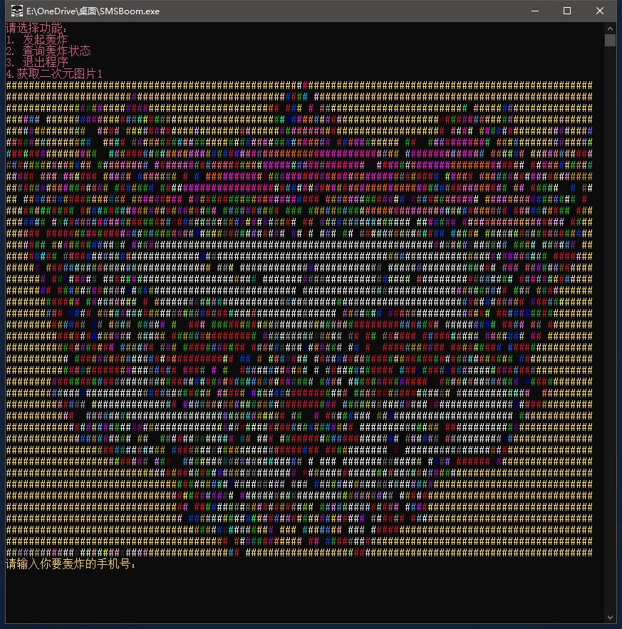
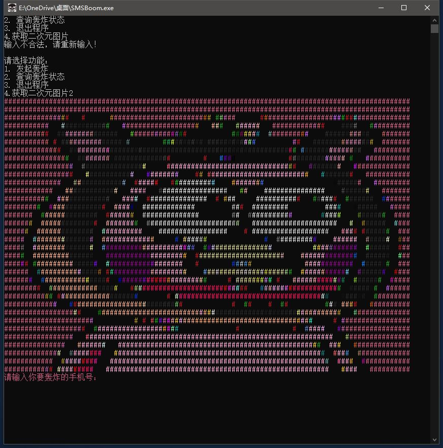
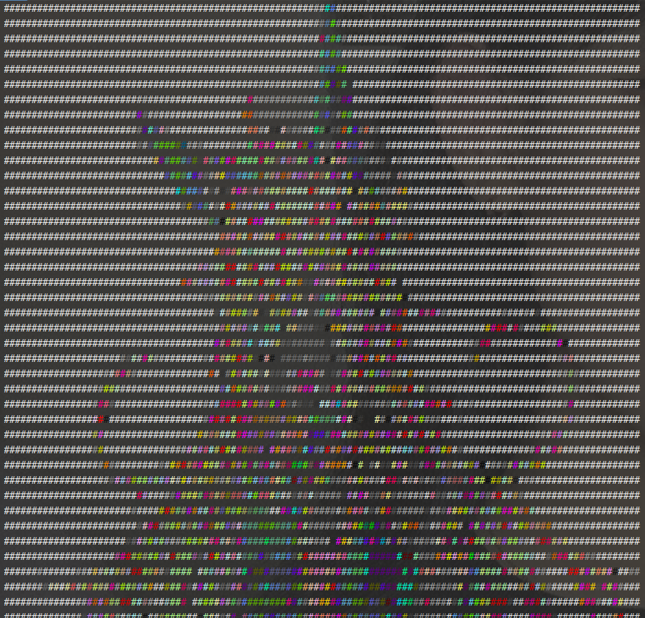
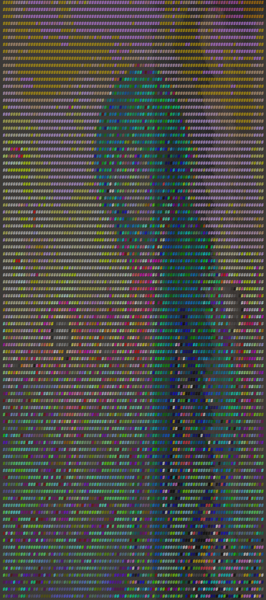
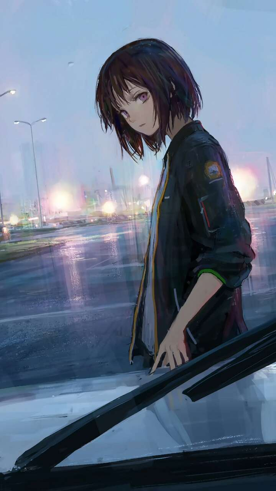

# color_console
## python命令行打印彩色图片

### 效果图：












### 代码部分

```python
import sys
import cv2
import requests
import colorama
import os
from urllib.parse import urlparse
# 初始化colorama
colorama.init()

# 获取并添加文件扩展名
def add_file_extension(filename, url):
    parsed = urlparse(url)
    root, ext = os.path.splitext(parsed.path)
    return filename + ext.strip()

# 下载图片并命名
url = 'https://api.ghser.com/random/pe.php'
response = requests.get(url)

filename = os.path.basename(url)
filename = os.path.splitext(filename)[0]
filename = add_file_extension(filename, url)

with open(filename, 'wb') as f:
    f.write(response.content)

img = cv2.imread(filename,0)  #读入灰度图

def img_color_ascii(img, r=3):
    # img: input img
    # r:  raito params #由于不同控制台的字符长宽比不同，所以比例需要适当调整。
    # window cmd：r=3/linux console r=

    grays = "@%#*+=-:. "  # 由于控制台是白色背景，所以先密后疏/黑色背景要转置一下
    gs = 10  # 10级灰度
    # grays2 = "$@B%8&WM#*oahkbdpqwmZO0QLCJUYXzcvunxrjft/\|()1{}[]?-_+~i!lI;:,\"^.` "
    # gs2 = 67              #67级灰度

    # 宽（列）和高（行数）
    w = img.shape[1]
    h = img.shape[0]
    ratio = r * float(w) / h  # 调整长宽比-根据终端改变r

    scale = w // 100  # 缩放尺度/取值步长，向下取整，每100/50个像素取一个 值越小图越小(scale 越大)

    for y in range(0, h, int(scale * ratio)):  # 根据缩放长度 遍历高度 y对于h，x对应w
        strline = ''
        for x in range(0, w, scale):  # 根据缩放长度 遍历宽度
            idx = img[y][x] * gs // 255  # 获取每个点的灰度  根据不同的灰度填写相应的 替换字符
            if idx == gs:
                idx = gs - 1  # 防止溢出
            # 将真彩值利用命令行格式化输出赋予
            color_id = "\033[38;5;%dm%s" % (img[y][x], grays[2])  # 输出！
            strline += color_id  # 按行写入控制台
        print(strline)

img_color_ascii(img)

```

